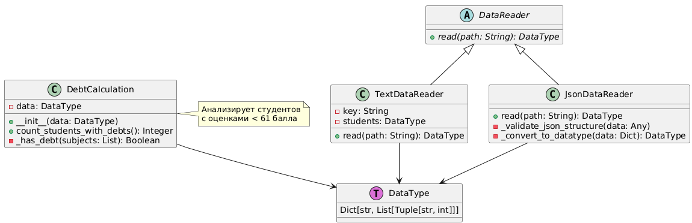

# Лабораторная работа 1 по дисциплине "Технологии программирования"

## Постановка задачи

Разработать систему для анализа успеваемости студентов, которая:
1. Читает данные о студентах и их оценках из файлов (JSON и текстовый формат)
2. Подсчитывает количество студентов с академическими задолженностями (оценки < 61)
3. Обеспечивает модульное тестирование всей функциональности

### Требования к функциональности:
- Поддержка multiple форматов входных данных
- Выявление студентов с низкой успеваемостью
- Комплексное тестирование всех компонентов системы

## Краткое описание проекта

Проект представляет собой модульную систему анализа академических задолженностей студентов, построенную на принципах объектно-ориентированного программирования. Система обрабатывает данные о студентах и их оценках, идентифицируя студентов с академическими задолженностями.

### Основные возможности:
- **Чтение данных** из JSON и текстовых файлов
- **Анализ задолженностей** - подсчет студентов с оценками ниже 61 балла
- **Модульное тестирование** - полное покрытие тестами всех компонентов

## Используемые технологии

### Язык программирования:
- **Python 3.14** - основной язык разработки

### Библиотеки и фреймворки:
- **pytest** - фреймворк для модульного тестирования
- **json** - работа с JSON форматом
- **argparse** - обработка аргументов командной строки
- **typing** - аннотации типов для статического анализа

### Инструменты разработки:
- **Git** - система контроля версий
- **VS Code** - среда разработки
- **pytest** - запуск тестов
- **UML** - проектирование архитектуры

## UML-диаграмма классов

## Выводы по работе

Проект демонстрирует профессиональный подход к разработке программного обеспечения и может быть использован как основа для реальных систем анализа образовательных данных. Архитектура позволяет легко расширять функциональность и адаптировать систему под конкретные требования.